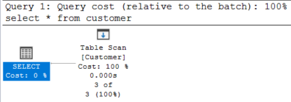

# Lekérdezés optimalizálás labor / Query optimization laboratory

## Feladat 1

A kiadott parancsok:

- `select * from customer`
- `select * from customer where id = 1`
- a többi is hasonló, csak az `id` mezőt használjuk

A lekérdezési terv mindegyikre nagyon hasonló, mindegyik _table scan_-t használt:

Magyarázat: az optimalizáló nem tud indexet használni, a tárolás sorrendjével kapcsolatban sem élhet feltételezéssel, így minden lekérdezés _table scan_ lesz.

## Következő nagyon izgalmas feladat

Add meg a használt SQL utasításokat. Ha egy feladatban nagyon hasonlóak (mint fentebb), nem szükséges mindegyiket megadod, csak jelezd 1-2 példával.

A kapott lekérdezési tervet képként tedd be. Ha a lekérdezési tervek nagyon hasonlóak (mint az első feladatban), elég csak egyet megmutatnod.

Értékeld a kapott tervet, magyarázd meg, mit látsz, és miért.

## Exercise 1

The SQL commands executes:

- `select * from customer`
- `select * from customer where id = 1`
- the rest are identical with the exception of querying `id` instead of every column

All the query plans look the same, all use _table scan_:

Explanation: the optimizer cannot use an index, because there are not suitable ones, hence the only option is _table scan_.

## Next exercise

List the SQL statements used. If the statements are very similar, you list only one or two and explain this (as above).

Create a screenshot of the plan and insert it as an embedded image. If the plans are very similar, you only need to insert one and explain the fact.

Evaluate and explain the plan: what does it contain and why.
